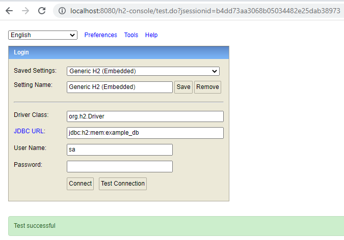
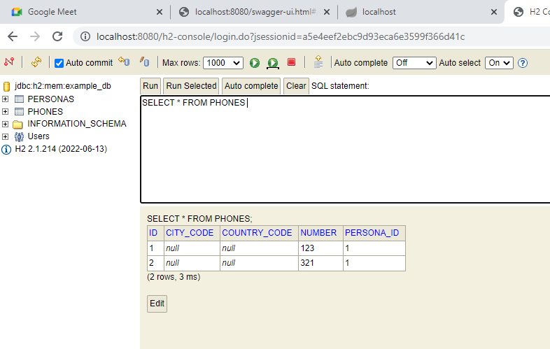

Este proyecto fue Generado con Open AI

1.- Bajar el proyecto desde git.

2.- Abrir en un IDE

Ejemplo en Spring Tools 4

Conectarse a la base de datos h2:

Hibernate creará automàticamente la tabla usuarios:

además de la tabla phones:

Para ejecutarlo abrir un DashBoard en el Menu, y ejecutar el proyecto:

Luego ejecutar con Postman:

Ejemplo para create:

